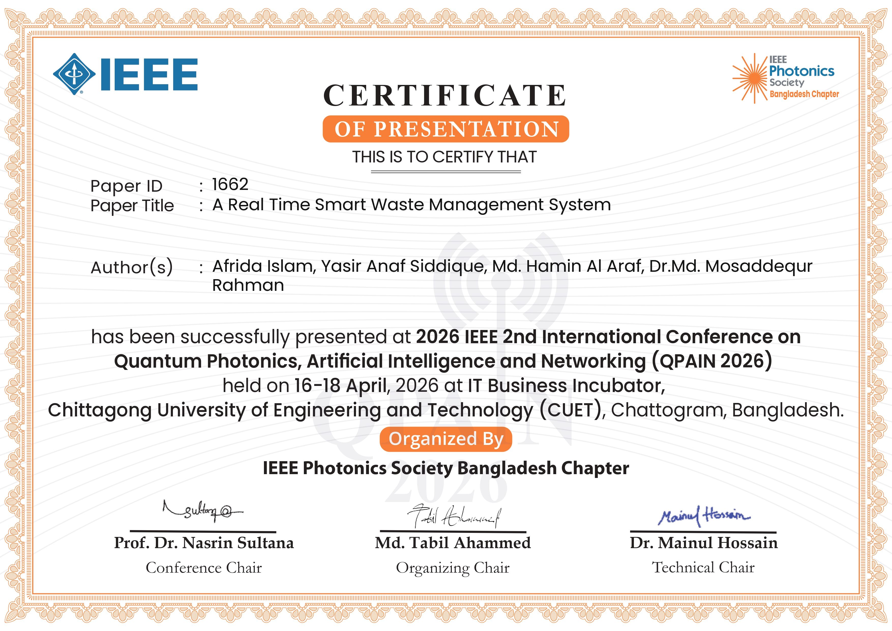

<div align="center">

# ♻️ Real-Time Smart Waste Management System


<br>


<br>


</div>

---

## 🏆 IEEE Publication

### A Real Time Smart Waste Management System

Published in the **IEEE 2nd QPAIN International Conference 2026**

| Information | Details |
|------------|---------|
| Conference | IEEE 2nd QPAIN International Conference |
| Conference Date | 16–18 April 2026 |
| IEEE Xplore Publication Date | 11 June 2026 |
| DOI | 10.1109/QPAIN69676.2026.11545725 |
| Classification Accuracy | 92% |

---

## 👨‍🔬 Authors

| Authors |
|----------|
| Afrida Islam |
| Md. Hamin Al Araf |
| Yasir Anaf Siddique |
| Md. Mosaddequr Rahman |

---

## 🏅 Conference Certificate

<div align="center">



### Certificate ID: PID-1662

</div>

---

## 📖 Abstract

Waste management is one of the most serious issues of contemporary campuses and urban areas that may lead to an unsanitary environment, resource wastage, and environmental damage.

This project introduces the design and implementation of an intelligent waste management system that combines IoT sensors, machine learning, and cloud-based monitoring.

The system includes a low-cost sensor-based design and a machine learning architecture utilizing Raspberry Pi and YOLOv8n for real-time waste classification.

With 92% classification accuracy, reliable hazard detection, and continuous monitoring, the system minimizes collection trips, promotes recycling, and encourages responsible waste disposal behavior through a reward mechanism.

Aligned with global sustainability goals, the proposed framework provides a scalable and replicable solution for cleaner, smarter, and more sustainable communities.

---

## 🚀 Project Features

### ♻️ Smart Waste Classification

- Real-time waste recognition
- YOLOv8n object detection
- Intelligent waste categorization

### 📡 IoT Monitoring

- Ultrasonic fill-level detection
- Overflow prevention
- Automated notifications

### ☁️ Cloud Integration

- Real-time data monitoring
- Historical analytics
- Remote access dashboard

### 🎁 Reward System

- User engagement
- Recycling incentives
- Sustainable behavioral encouragement

### ⚠️ Hazard Detection

- Hazardous waste identification
- Improved safety
- Smart alert generation

---

## 🧠 Machine Learning Performance

| Metric | Result |
|----------|----------|
| Model | YOLOv8n |
| Accuracy | 92% |
| Processing | Real-Time |
| Platform | Raspberry Pi |
| Monitoring | Cloud-Based |

---

## 🏗️ System Architecture

```text
                    Waste Input
                         │
                         ▼
                Camera + Sensors
                         │
                         ▼
                   Raspberry Pi
                         │
          ┌──────────────┴──────────────┐
          ▼                             ▼
     YOLOv8n Model             Ultrasonic Sensor
          │                             │
          └──────────────┬──────────────┘
                         ▼
                   Cloud Database
                         ▼
                   Web Dashboard
                         ▼
                    Reward System
````

---

## 🔑 IEEE Keywords

```text
Internet of Things
Modeling
Waste Management
Machine Learning
Recycling
Image Sensors
Real-Time Systems
Cloud Computing
Raspberry Pi
Image Classification
Ultrasonic Sensors
Waste Separation
```

---

## 🛠 Technologies Used

* Raspberry Pi
* Python
* YOLOv8n
* OpenCV
* Ultrasonic Sensors
* IoT Communication
* Cloud Computing
* Machine Learning
* Edge AI

---

## 🌍 Sustainability Impact

✅ Reduced waste collection trips

✅ Improved recycling rates

✅ Lower greenhouse gas emissions

✅ Cleaner campus environments

✅ Sustainable urban infrastructure

✅ Smart city readiness

---

## 📈 Future Work

* Mobile App Integration
* Smart City Deployment
* Carbon Footprint Analytics
* Multi-Bin Monitoring Network
* AI-Based Collection Optimization
* Advanced Hazard Prediction

---


---

## ⭐ Research Contribution

This work contributes to sustainable urban infrastructure by combining Artificial Intelligence, Internet of Things (IoT), Edge Computing, and Cloud Technologies to automate waste classification and monitoring.

The proposed framework demonstrates a practical approach for deploying scalable smart waste management systems in educational institutions, municipalities, and future smart cities.

---

<div align="center">

### ♻️ Building Smarter Waste Management Through AI, IoT and Sustainability


</div>

